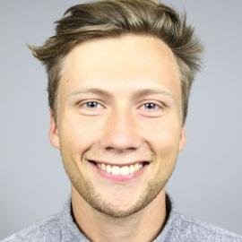

## Michael Asger Andersen, MD, PhD
### Clinical Pharmacologist in Training & Researcher

{width=25% style="float:right; margin-left:20px; margin-bottom:10px; border:3px solid #3498db;"}

## Professional Journey

I am a clinical pharmacologist in training focusing on personalized medicine approaches. My work in medicine has led me to explore how medications affect different patient populations and methods to optimize treatment strategies.

My research areas include practical implementation of pharmacogenetics, therapeutic drug monitoring, and developing improved clinical trial designs that incorporate statistical methods for personalized treatments.

### Current Position

I am currently completing my training at the Department of Clinical Pharmacology at Bispebjerg and Frederiksberg Hospital. Here, I work on translating pharmacogenetic findings into clinical practice through collaboration with specialists across different medical fields. Our goal is to create practical guidelines and tools that help clinicians apply genetic information effectively in patient care.

### Previous Experience

Before my current position, I worked as an epidemiologist in training at the Department of Infectious Disease Epidemiology & Prevention at Statens Serum Institut (SSI) during the COVID-19 pandemic, analyzing register data and contributing to monitoring systems.

My earlier research on chronic lymphocytic leukemia (CLL) identified increased infection risks in these patients. This work informed several follow-up studies and contributed to the development of the PreVentACall randomized clinical trial.

## Research Interests

- **Pharmacogenetics**: Implementation strategies for genetic testing in clinical settings
- **Therapeutic Drug Monitoring**: Concentration-based dosing optimization
- **Infection Risk in Hematological Malignancies**: Patterns and prediction models
- **Register-Based Epidemiology**: Applications of Danish national health registers

## Personal Life

Outside of my professional work, I enjoy spending quality time with my girlfriend and two sons. I'm an avid disc golf player ([**PDGA 113200**](https://www.pdga.com/player/113200)) and enjoy watching movies in my free time.

## Connect With Me

I'm always open to new collaborations, discussions, and opportunities to share knowledge. If you're interested in my research or would like to discuss potential collaborations, please don't hesitate to contact me.