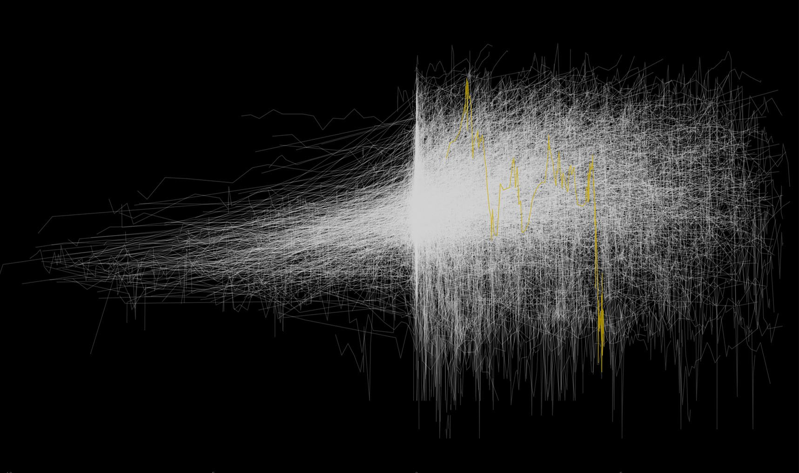

```{=html}
<div class="publication-header">
  <div class="pub-header-content">
    <h2>Research Publications</h2>
    <p>Google Scholar H-Index: 15 | Citations: 700+</p>
    <p>
      <a href="https://scholar.google.dk/citations?hl=da&user=Bu8uQCAAAAAJ" target="_blank" class="btn btn-primary"><i class="fa fa-google"></i> View Google Scholar Profile</a>
      <a href="https://pubmed.ncbi.nlm.nih.gov/?term=andersen+ma&sort=date" target="_blank" class="btn btn-primary"><i class="fa fa-book"></i> View PubMed Publications</a>
    </p>
  </div>
  <div class="featured-research">
    <div class="featured-image">
      
      <div class="image-caption">Finding a Needle in a Haystack (CLL progression)</div>
    </div>
  </div>
</div>
```
##
## Automatically Generated Publication List

```{r setup, include=FALSE}
knitr::opts_chunk$set(echo = FALSE, message = FALSE, warning = FALSE)
if (!requireNamespace("rentrez", quietly = TRUE)) install.packages("rentrez")
if (!requireNamespace("dplyr", quietly = TRUE)) install.packages("dplyr")
library(rentrez)
library(dplyr)

# Function to format authors correctly
format_authors <- function(authors) {
  if (length(authors) > 5) {
    paste0(paste(authors[1:5], collapse = ", "), ", et al.")
  } else {
    paste(authors, collapse = ", ")
  }
}

# Search PubMed for your publications
# You might need to refine this search term to get exactly your publications
search_term <- '(andersen ma[Author]) NOT (andersen mak[Author]) AND ("2015"[Date - Publication] : "3000"[Date - Publication])'
search_results <- rentrez::entrez_search(db = "pubmed", term = search_term, retmax = 100)

# Fetch publication details
if (length(search_results$ids) > 0) {
  pub_summaries <- rentrez::entrez_summary(db = "pubmed", id = search_results$ids)

  # Process the data into a data frame
  publications <- lapply(pub_summaries, function(pub) {
    # Extract and format date
    pub_date <- if (!is.null(pub$pubdate)) pub$pubdate else "No date"
    pub_year <- substr(pub_date, 1, 4)

    # Extract authors
    authors <- if (!is.null(pub$authors)) {
      format_authors(pub$authors$name)
    } else {
      "No authors listed"
    }

    # Create data frame row
    data.frame(
      Year = pub_year,
      Title = if (!is.null(pub$title)) pub$title else "No title",
      Authors = authors,
      Journal = if (!is.null(pub$fulljournalname)) pub$fulljournalname else if (!is.null(pub$source)) pub$source else "No journal",
      PMID = if (!is.null(pub$uid)) pub$uid else "No PMID",
      stringsAsFactors = FALSE
    )
  })

  # Combine into a single data frame
  publications_df <- do.call(rbind, publications)

  # Sort by year (descending)
  publications_df <- publications_df %>% arrange(desc(Year))
} else {
  publications_df <- data.frame(
    Year = NA,
    Title = "No publications found",
    Authors = NA,
    Journal = NA,
    PMID = NA
  )
}
```

```{r publication_list, results='asis'}
# Generate HTML for publications
for (i in 1:nrow(publications_df)) {
  pub <- publications_df[i, ]
  cat('<div class="publication-item">\n')
  cat(paste0('  <div class="publication-year">', pub$Year, "</div>\n"))
  cat(paste0('  <div class="publication-authors">', pub$Authors, "</div>\n"))
  cat(paste0('  <div class="publication-title">', pub$Title, "</div>\n"))
  cat(paste0('  <div class="publication-journal">', pub$Journal, "</div>\n"))
  cat(paste0("[PubMed: ", pub$PMID, "](https://pubmed.ncbi.nlm.nih.gov/", pub$PMID, "/)  \n"))
  cat("</div>\n\n")
}
```


```{=html}
<style>
/* Header styling with integrated image */
.publication-header {
  display: flex;
  flex-wrap: wrap;
  align-items: center;
  justify-content: space-between;
  margin-bottom: 3rem;
  padding-bottom: 2rem;
  border-bottom: 1px solid #eee;
  gap: 2rem;
}

.pub-header-content {
  flex: 1;
  min-width: 300px;
}

.pub-header-content h2 {
  margin-top: 0;
}

.featured-research {
  flex: 1;
  min-width: 300px;
  display: flex;
  justify-content: center;
}

.featured-image {
  position: relative;
  max-width: 100%;
  transition: transform 0.3s ease;
  border-radius: 6px;
  overflow: hidden;
  box-shadow: 0 4px 12px rgba(0,0,0,0.15);
}

.featured-image:hover {
  transform: translateY(-5px);
  box-shadow: 0 8px 20px rgba(0,0,0,0.2);
}

.featured-image img {
  width: 100%;
  height: auto;
  display: block;
  border-radius: 6px;
}

.image-caption {
  position: absolute;
  bottom: 0;
  left: 0;
  right: 0;
  background: rgba(0,0,0,0.7);
  color: white;
  padding: 10px 15px;
  font-style: italic;
  font-size: 0.9rem;
  text-align: center;
}

/* Publication list styling */
.publication-item {
  padding: 1.5rem;
  margin-bottom: 1.5rem;
  border-left: 4px solid #3498db;
  background-color: #f8f9fa;
  border-radius: 0 4px 4px 0;
  transition: transform 0.2s ease, box-shadow 0.2s ease;
}

.publication-item:hover {
  transform: translateX(5px);
  box-shadow: 0 3px 10px rgba(0,0,0,0.1);
}

.publication-year {
  font-weight: bold;
  color: #3498db;
  margin-bottom: 0.5rem;
}

.publication-authors {
  font-style: italic;
  margin-bottom: 0.5rem;
  color: #555;
}

.publication-title {
  font-weight: bold;
  margin-bottom: 0.5rem;
  font-size: 1.1rem;
}

.publication-journal {
  margin-bottom: 0.5rem;
  color: #666;
}

.publication-links a {
  color: #3498db;
  text-decoration: none;
  font-weight: bold;
}

.publication-links a:hover {
  text-decoration: underline;
}

@media (max-width: 768px) {
  .publication-header {
    flex-direction: column;
  }

  .featured-research {
    width: 100%;
  }
}
</style>
```